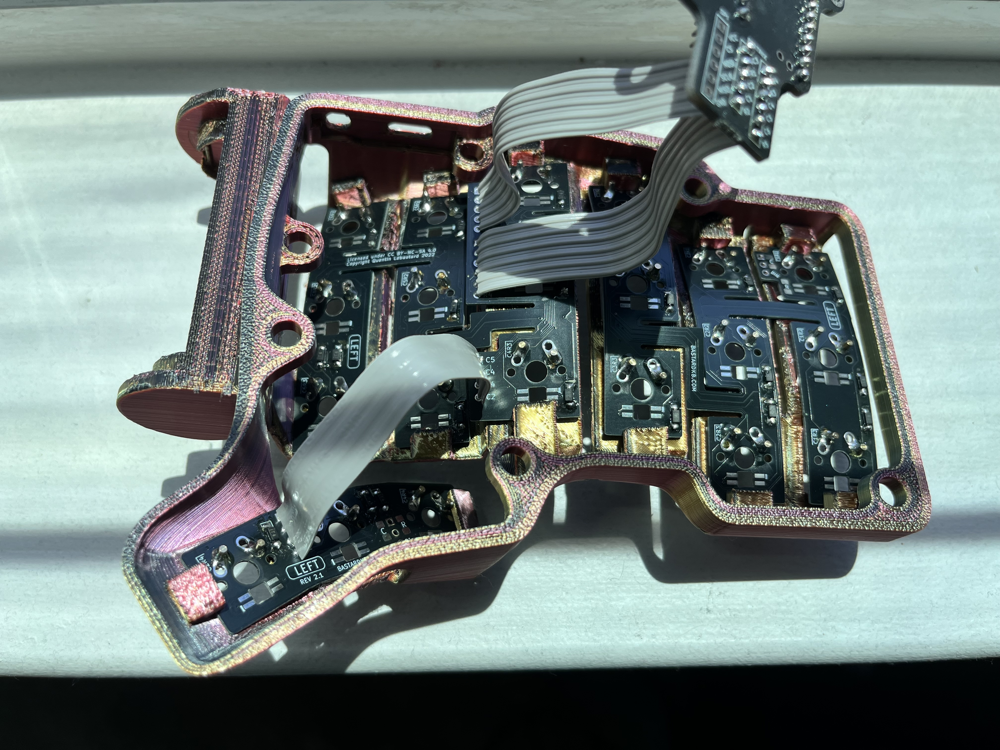
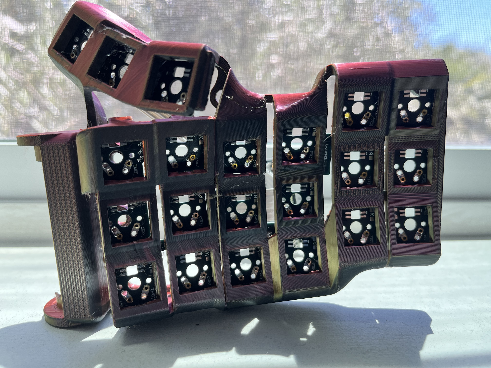
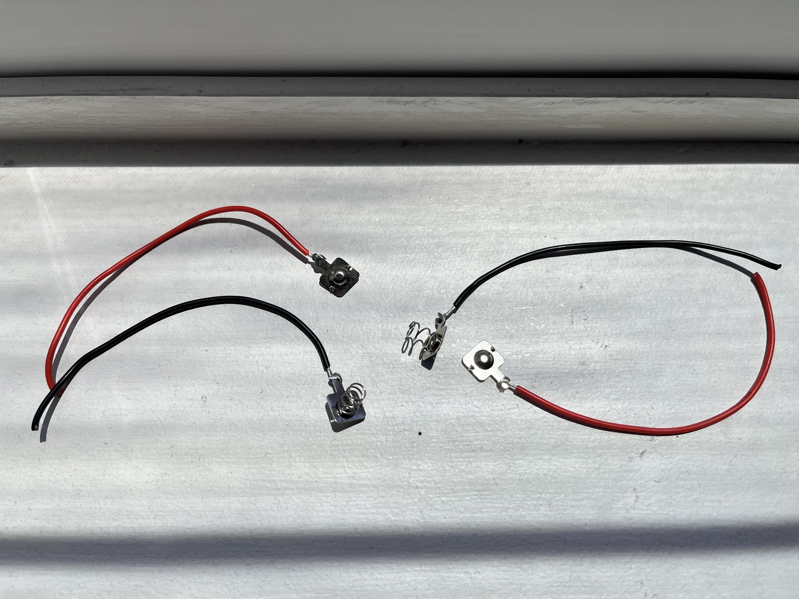
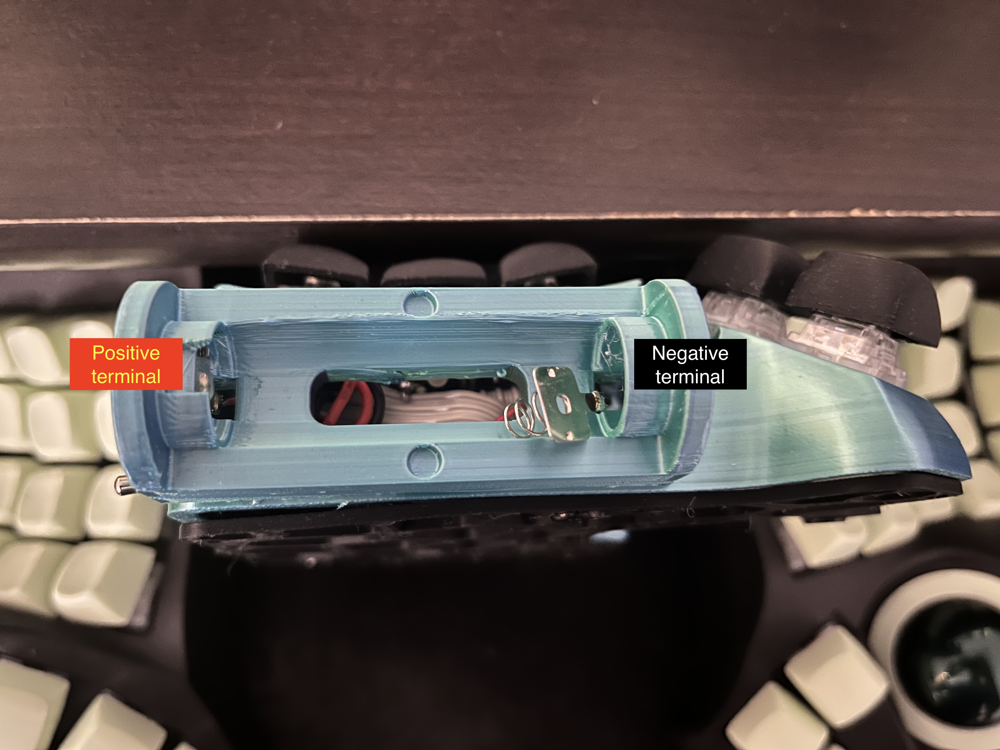

# Charybdis Mini and Charybdis Nano with AA battery (14500 3.7v Li-Ion battery)

Charybdis is an ergonomic, open source keyboard designed and developed by [Bastardkb](https://github.com/Bastardkb/Charybdis).

The conventional wireless build for the Charybdis line of keyboards uses Li-Ion batteries, like the 401030 130mAh battery. The internal housing, which is specifically designed to be a wired keyboard, limits the battery size. Lower battery sizes offer less battery capacity, thereby reducing the battery life on the keyboard([ZMK battery life can be computed here](https://zmk.dev/power-profiler)).

My contribution towards this project is the addition of AA battery (14500 3.7v Li-Ion battery) holders to the Charybdis. This will increase the battery capacity usable for Charybdis to 2500-3800mAh from current values of 130-300mAh. This repository contains files for the right and left cases for the "Mini" and "Nano" versions of Charybdis. This builds on top of [Snap Fit Cases for Charybdis Mini and Charybdis Nano](https://github.com/rohithjayarajan/charybdis_mini_nano_snap_fit)

## BUILD GUIDE
Follow the wireless build guide detailed in [280Zo/charybdis-wireless-mini-3x6-build-guide](https://github.com/280Zo/charybdis-wireless-mini-3x6-build-guide). We use the same build with modifications at only 2 places:

1. Battery.
2. Toggle Switch.

| **Part**                                                                                                 | **Quantity** |
| -------------------------------------------------------------------------------------------------------- | ------------ |
| [14500 3.7v AA Battery (dimensions 14mm*50mm)](https://a.co/d/7Be3EjO) | 2            |
| [AA Battery Contact Plates (max dimensions 10mm*10mm)](https://www.aliexpress.com/item/2251832697974737.html?spm=a2g0o.order_list.order_list_main.104.45091802w1A1m8)             | 2 pairs           |
| [Vertical Right Angle Toggle Switch (I got the 7mm MTS-102C3 variant)](https://www.aliexpress.us/item/3256808105874261.html?spm=a2g0o.order_list.order_list_main.11.45091802w1A1m8&gatewayAdapt=glo2usa)       | 1            |
| Cylindrical Magnets (dimensions 4mm*2mm)    | 1            |

### SNAP FIT INSTALLATION
Installation is trivial:

1. Insert the PCBs from [Bastard Keyboards](https://bastardkb.com/) by bending them and locking them in the snap fits.
2. Exercise caution when bending the thumb PCB cluster as they might not be as flexible as the 3x6 or 3x5 PCB plates.
3. In case you are unable to fit the PCBs in the snap fits: One potential check would be to ensure there are no supports under the snap fits.

#### CHARYBDIS MINI SNAP FIT CASE BOTTOM VIEW (LEFT)

#### CHARYBDIS NANO SNAP FIT CASE TOP VIEW (LEFT)

### PREPARE THE BATTERY CONNECTIONS

1. Solder the wires to the AA battery contact plates
2. Insert the wires soldered to the battery contact plates through the holes in the battery holder
3. Note that the negative terminal wire (the one attached to the spring plate) will go inside the hole in the battery holder that is closest to the thumb cluster. You will be able to visually notice that this side has more depth so as to house the spring
4. Once inserted through these holes, solder the battery terminal wires to the appropriate battery power pins.

#### BATTERY PLATES

#### BATTERY INSERTS

### MOUNT TOGGLE SWITCH

We need a toggle switch for easy access to toggle the keyboard ON/OFF. This is the solution I proceeded with, inspired by community builds using the same toggle switch component in [BastardKB discord community](http://www.bstkbd.com/discord).

1. Re-purpose the TRRS cable hole in the case for the toggle switch. Use a deburring tool (or soldering iron) to increase the diameter of the hole if needed.
2. For the specific toggle switches that I used, I oriented it in such a way that the pins of the toggle switches face the keycaps.

### BATTERY HOLDER COVER

The dimensions of the cover are such that it exactly fits the battery holder. Using some amount of force to secure it should keep it in place firmly without any locks/magnetic snap fits.

However, inserts are provided for cylindrical magnets of dimensions 4mm*2mm both on the battery holder and the battery cover.
